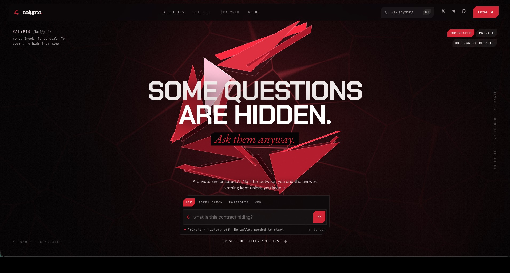
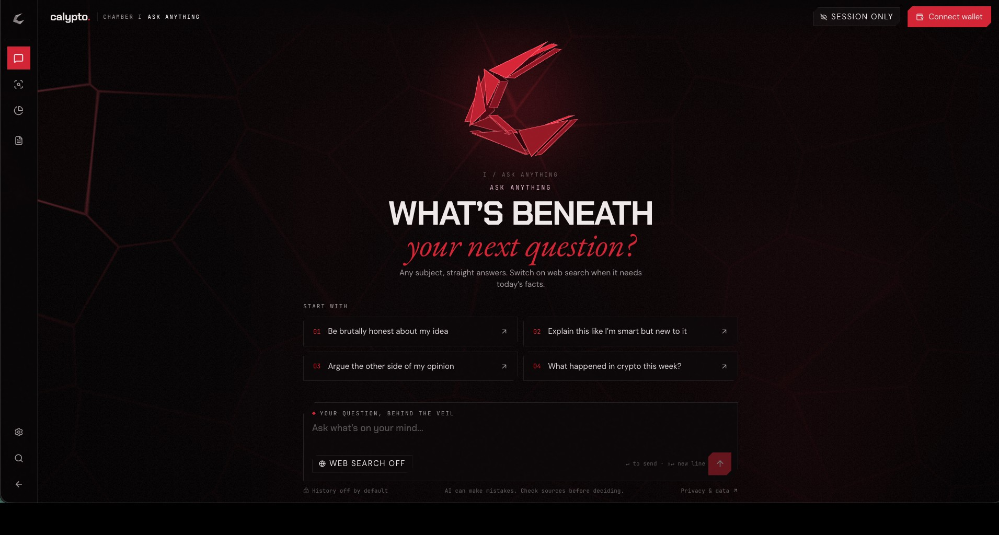
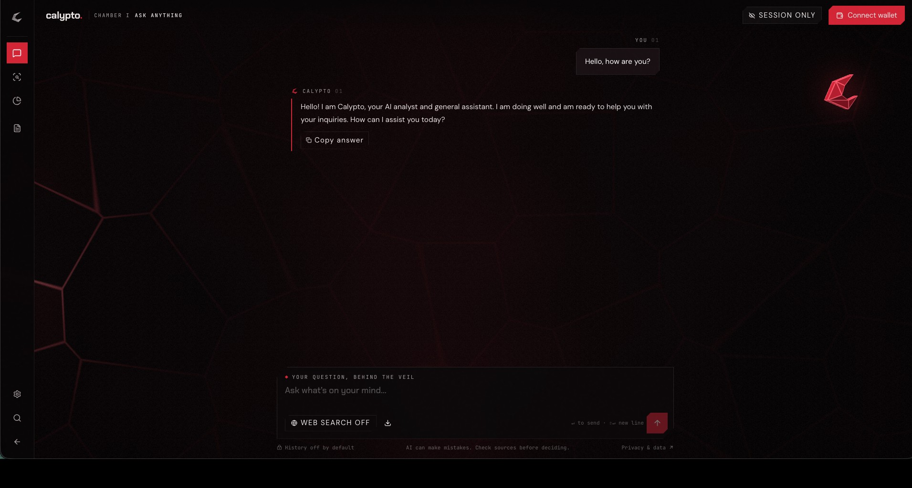

<h1 align="center">Calypto</h1>
<p align="center"><strong>Some questions are hidden. Ask them anyway.</strong></p>
<p align="center">AI. Privacy. Uncensored.</p>

<p align="center">
  <a href="https://calypto.pro">Open Calypto</a> &nbsp; / &nbsp;
  <a href="docs/GETTING_STARTED.md">Get started</a> &nbsp; / &nbsp;
  <a href="docs/ARCHITECTURE.md">Architecture</a> &nbsp; / &nbsp;
  <a href="https://x.com/Calypto_Privacy">X</a> &nbsp; / &nbsp;
  <a href="https://t.me/Calypto_Privacy">Telegram</a>
</p>

<p align="center">
  <a href="https://github.com/Calypto-Dev/Calypto-Privacy/actions/workflows/build.yml"></a>
  <a href="https://github.com/Calypto-Dev/Calypto-Privacy/actions/workflows/session-security.yml"></a>
  <a href="https://github.com/Calypto-Dev/Calypto-Privacy/actions/workflows/chain-data.yml"></a>
</p>

Calypto is an AI workspace for asking questions, researching the web and exploring public onchain data on Robinhood Chain. General conversation, token checks and wallet analysis share one interface, with conversation history switched off by default.

## Screens



| Ask anything | A conversation |
| --- | --- |
|  |  |

## What You Can Do

- **Ask anything:** explore ideas, compare arguments, write and get explanations in the chat workspace.
- **Research the web:** turn on web search for current information and follow the sources included in answers.
- **Check a token:** inspect public contract and market information, with coverage depending on the chain indexer and market data available.
- **Read a wallet:** examine public balances and recent activity on Robinhood Chain.
- **Choose what to save:** keep a session temporary, or explicitly enable saved text history and use deletion or Markdown export.

## Explore The Code

| Area | Included |
| --- | --- |
| Interface | Landing page, animated entrance, crimson folded logo and chamber workspace |
| Chat | Server-side AI requests, bounded conversation context and optional web research |
| Chain data | Robinhood Chain RPC, Alchemy wallet data, Blockscout and market lookups |
| Sessions | Signed anonymous visitor cookies and three free trial prompts |
| Wallet access | Ownership challenges, replay protection and server-side balance checks |
| History | Optional text storage with scoped access, deletion and export |
| Request controls | Rate limits, atomic quotas, request leases and failed-request refunds |
| Tests | Session security, access rules, abuse controls and provider-adapter fixtures |

## How A Question Works

1. The browser sends the question to Calypto's server route.
2. The server checks the session, request budget and available prompt quota.
3. Optional research or public chain context is gathered for the request.
4. The server asks the AI provider and returns the answer to the workspace.
5. Saving the conversation requires the user to enable history.

AI requests pass through the server and an external model provider. Unsaved chat content is not written to Calypto's conversation database; essential access and usage metadata is retained to operate the service. Public wallet activity remains public. See the application's privacy page for its data policy.

## Access

Visitors start with three free prompts. After those are used, verified holders can access daily tiers: $50 of $CALYPTO for 10 prompts, $100 for 20, and $150 for 30. Holder checks require the configured Robinhood Chain contract, a working RPC, and an indexed DEX Screener market with at least $1,000 liquidity. A contract address alone does not guarantee that a usable price is available.

The homepage and access-page copy follow the contract configuration automatically. Until a valid address is configured, they show "$CALYPTO coming soon."

The server-side `DISABLE_TRIAL_LIMIT` switch defaults to `false`. Setting it to `true` temporarily pauses the trial cutoff and holder requirement while keeping daily capacity and abuse protections active. Temporary usage is counted separately so restoring the trial retains its original counts. The live site currently has the three-prompt limit enabled. Runtime settings are configured separately from this repository.

## Run Locally

Use Node.js 22.13+ and pnpm 11.25.0.

```sh
pnpm install --frozen-lockfile
cp .env.example .env.local
pnpm dev
```

Configure the server-side values described in [.env.example](.env.example). AI requests require `AI_API_KEY`, `AI_MODEL`, `AI_BASE_URL` and a matching `AI_ALLOWED_ORIGIN`; session security requires a random `SESSION_SECRET` of at least 32 characters. Alchemy and Blockscout keys enable their respective data adapters. Never put secret values in browser code or Git.

The AI adapter uses a compatible chat-completions API. Provider-specific chat and web-research options belong in private runtime JSON settings, with an optional citation response path. There is no hardcoded provider, endpoint or model. Web research requires a provider that supports it and the corresponding runtime options; changing the variable names alone does not make an arbitrary provider compatible. See [setup notes](docs/GETTING_STARTED.md).

The project uses Next.js through vinext, Cloudflare Workers and D1. Apply the SQL migrations in `drizzle/` to the configured D1 database before deploying. A standalone deployment must supply its own Cloudflare bindings and runtime secrets; the hosted service's credentials and database are not included here.

## Checks

```sh
node node_modules/typescript/bin/tsc --noEmit
node tests/security.mjs
node tests/identity.mjs
node tests/ai-adapter.mjs
node tests/chain-data.mjs
python3 tests/access-rules.py
python3 tests/abuse-rules.py
pnpm build
```

The Actions workflows run the checks independently so a failure identifies the affected area. Provider tests use fixtures and do not require production API keys.

## Repository Map

| Directory | Purpose |
| --- | --- |
| `app/` | Pages, styles and the API route |
| `components/` | Workspace controls and visual components |
| `lib/` | AI, chain data, sessions and access logic |
| `db/`, `drizzle/` | Database schema and migrations |
| `tests/` | Behavioral and security checks |
| `build/`, `scripts/` | Framework and hosting integration |
| `docs/assets/` | Project banner and supplied screenshots |
| `.github/workflows/` | Automated checks |

## Contributions And Rights

For support, contact [support@calypto.pro](mailto:support@calypto.pro).

Describe the problem and how you verified a proposed change in your pull request. Do not include API keys, saved conversations or private wallet credentials in issues or commits.

A project-wide open-source license has not been selected. Source is published for review; third-party code retains its own licenses and notices.
